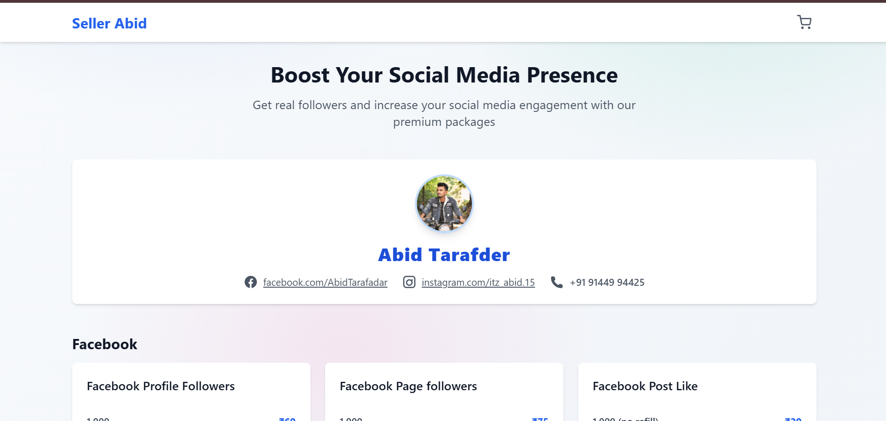

# FameBoost - Social Media Followers E-commerce Website

A complete, responsive e-commerce website for selling social media follower packages. Built with HTML, CSS (Tailwind), and JavaScript.

## Features

- ✅ Fully responsive design (mobile, tablet, desktop)
- ✅ Shopping cart functionality
- ✅ Payment modal with QR code
- ✅ Order confirmation via email
- ✅ Professional, clean design
- ✅ No backend required

## Quick Setup

1. **Open `index.html`** in your web browser
2. **Customize the configuration** in `script.js`:
   - Change `CONFIG.ownerEmail` to your email address
   - Change `CONFIG.qrCodeUrl` to your payment QR code image
   - Update `CONFIG.businessName` if needed


## 🖼️ Preview



## File Structure

```
├── index.html          # Main HTML file
├── styles.css          # Custom CSS styles
├── script.js           # JavaScript functionality
└── README.md           # This file
```

## Customization Guide

### 1. Change Your Email Address
In `script.js`, find the `CONFIG` object and update:
```javascript
const CONFIG = {
    ownerEmail: 'yourclientsemail@example.com', // Change this
    qrCodeUrl: 'https://placehold.co/250x250/ffffff/000000?text=Scan+To+Pay',
    businessName: 'FameBoost'
};
```

### 2. Add Your QR Code
Replace the placeholder QR code URL with your actual payment QR code:
```javascript
qrCodeUrl: 'https://your-domain.com/your-qr-code.png'
```

### 3. Modify Products
In `index.html`, find the product cards and update:
- Product names
- Prices (in Indian Rupees)
- Add/remove products as needed

### 4. Change Business Name
Update the business name in:
- `index.html` (header and title)
- `script.js` (CONFIG.businessName)

## How It Works

1. **Customer browses products** and adds items to cart
2. **Clicks "Buy Now"** or "Proceed to Checkout"
3. **Payment modal opens** with QR code and order form
4. **Customer pays** and fills in their details
5. **Email notification** is sent to you with order details
6. **Success message** is shown to customer

## Browser Compatibility

- Chrome (recommended)
- Firefox
- Safari
- Edge
- Mobile browsers

## Support

The website is designed to work without any backend server. All functionality is handled client-side using JavaScript.

## License

This project is created for your business use. Feel free to modify and customize as needed.
